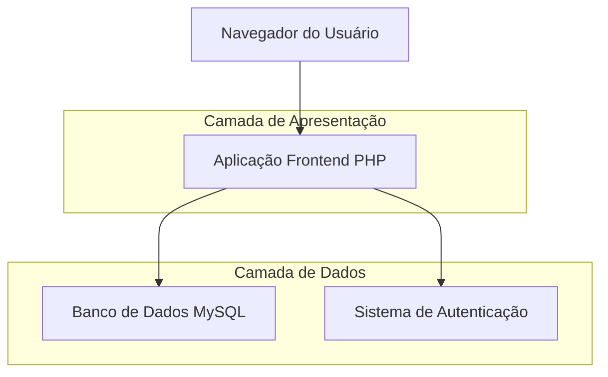
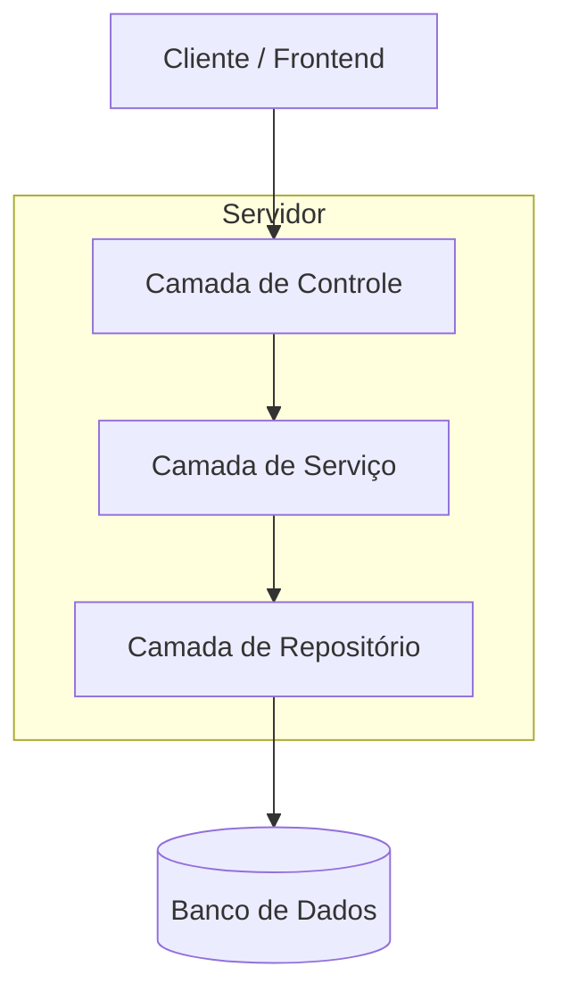
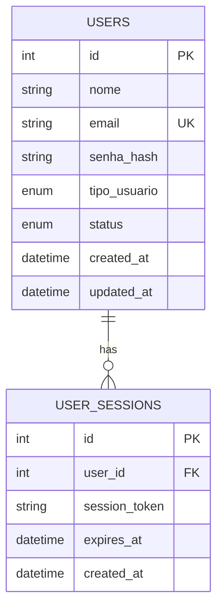

# Arquitetura Técnica - Sistema de Cadastro de Usuários

## 1. Design da Arquitetura



## 2. Descrição das Tecnologias
- Frontend: PHP 8.2 + Bootstrap 5 + JavaScript vanilla
- Backend: PHP 8.2 integrado
- Banco de Dados: MySQL 8.0
- Servidor Web: Apache 2.4
- Containerização: Docker + Docker Compose

## 3. Definições de Rotas
| Rota | Propósito |
|------|----------|
| /usuarios.php | Página principal de listagem de usuários |
| /usuarios.php?action=create | Formulário de criação de novo usuário |
| /usuarios.php?action=edit&id={id} | Formulário de edição de usuário existente |
| /usuarios.php?action=delete&id={id} | Processamento de exclusão de usuário |
| /api/usuarios.php | API para operações AJAX (busca, validação) |

## 4. Definições de API

### 4.1 API Principal

Criação de usuário
```
POST /api/usuarios.php
```

Request:
| Nome do Parâmetro | Tipo do Parâmetro | Obrigatório | Descrição |
|-------------------|-------------------|-------------|----------|
| nome | string | true | Nome completo do usuário |
| email | string | true | Email único do usuário |
| senha | string | true | Senha do usuário (será criptografada) |
| tipo_usuario | string | true | Tipo: 'admin', 'operador', 'visualizador' |
| status | string | true | Status: 'ativo', 'inativo' |

Response:
| Nome do Parâmetro | Tipo do Parâmetro | Descrição |
|-------------------|-------------------|----------|
| success | boolean | Status da operação |
| message | string | Mensagem de retorno |
| user_id | integer | ID do usuário criado (se sucesso) |

Exemplo:
```json
{
  "nome": "João Silva",
  "email": "joao@empresa.com",
  "senha": "senha123",
  "tipo_usuario": "operador",
  "status": "ativo"
}
```

Listagem de usuários
```
GET /api/usuarios.php
```

Request:
| Nome do Parâmetro | Tipo do Parâmetro | Obrigatório | Descrição |
|-------------------|-------------------|-------------|----------|
| page | integer | false | Número da página (padrão: 1) |
| limit | integer | false | Itens por página (padrão: 10) |
| search | string | false | Busca por nome ou email |
| tipo | string | false | Filtro por tipo de usuário |
| status | string | false | Filtro por status |

Response:
| Nome do Parâmetro | Tipo do Parâmetro | Descrição |
|-------------------|-------------------|----------|
| success | boolean | Status da operação |
| data | array | Lista de usuários |
| total | integer | Total de registros |
| page | integer | Página atual |
| pages | integer | Total de páginas |

## 5. Arquitetura do Servidor



## 6. Modelo de Dados

### 6.1 Definição do Modelo de Dados



### 6.2 Linguagem de Definição de Dados

Tabela de Usuários (users)
```sql
-- criar tabela
CREATE TABLE users (
    id INT AUTO_INCREMENT PRIMARY KEY,
    nome VARCHAR(100) NOT NULL,
    email VARCHAR(255) UNIQUE NOT NULL,
    senha_hash VARCHAR(255) NOT NULL,
    tipo_usuario ENUM('admin', 'operador', 'visualizador') DEFAULT 'visualizador',
    status ENUM('ativo', 'inativo') DEFAULT 'ativo',
    created_at TIMESTAMP DEFAULT CURRENT_TIMESTAMP,
    updated_at TIMESTAMP DEFAULT CURRENT_TIMESTAMP ON UPDATE CURRENT_TIMESTAMP
);

-- criar índices
CREATE INDEX idx_users_email ON users(email);
CREATE INDEX idx_users_tipo ON users(tipo_usuario);
CREATE INDEX idx_users_status ON users(status);
CREATE INDEX idx_users_created_at ON users(created_at DESC);

-- dados iniciais
INSERT INTO users (nome, email, senha_hash, tipo_usuario, status) VALUES
('Administrador', 'admin@sistema.com', '$2y$10$92IXUNpkjO0rOQ5byMi.Ye4oKoEa3Ro9llC/.og/at2.uheWG/igi', 'admin', 'ativo'),
('Operador Teste', 'operador@sistema.com', '$2y$10$92IXUNpkjO0rOQ5byMi.Ye4oKoEa3Ro9llC/.og/at2.uheWG/igi', 'operador', 'ativo');
```

Tabela de Sessões (user_sessions)
```sql
-- criar tabela
CREATE TABLE user_sessions (
    id INT AUTO_INCREMENT PRIMARY KEY,
    user_id INT NOT NULL,
    session_token VARCHAR(255) NOT NULL,
    expires_at TIMESTAMP NOT NULL,
    created_at TIMESTAMP DEFAULT CURRENT_TIMESTAMP,
    FOREIGN KEY (user_id) REFERENCES users(id) ON DELETE CASCADE
);

-- criar índices
CREATE INDEX idx_sessions_token ON user_sessions(session_token);
CREATE INDEX idx_sessions_user_id ON user_sessions(user_id);
CREATE INDEX idx_sessions_expires ON user_sessions(expires_at);
```