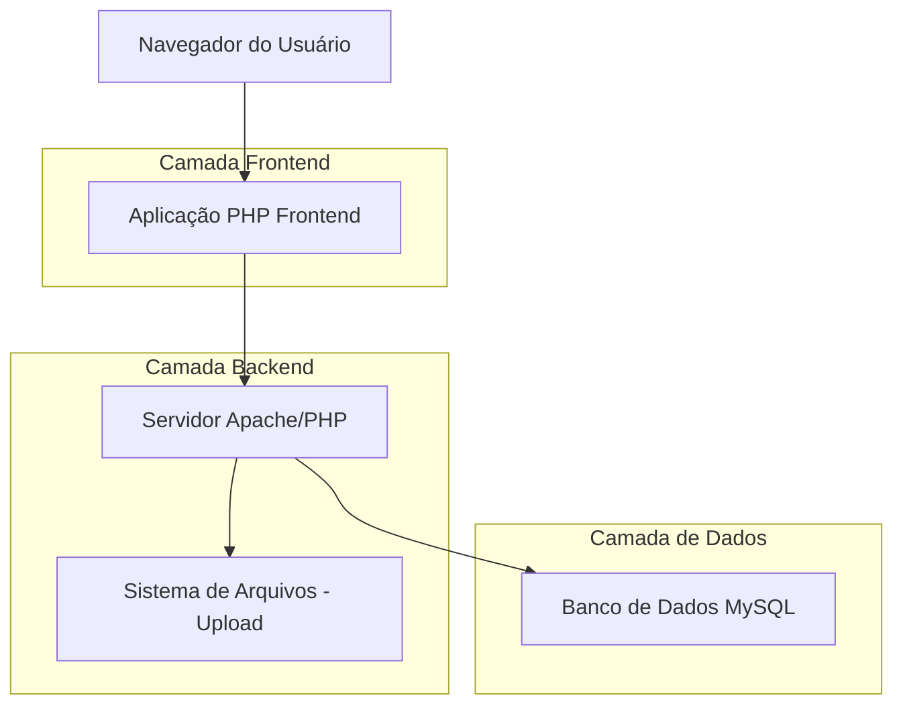
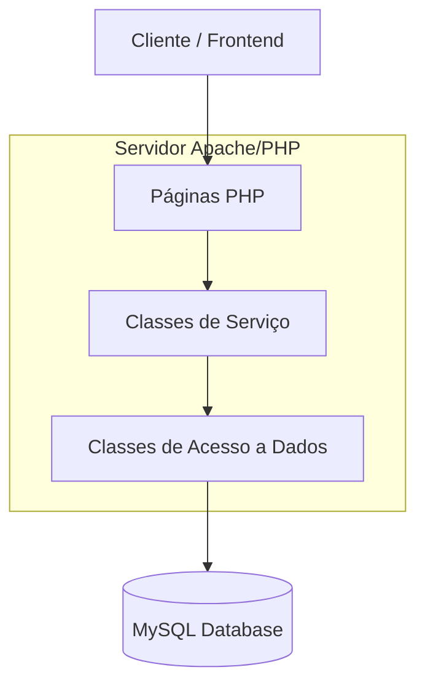
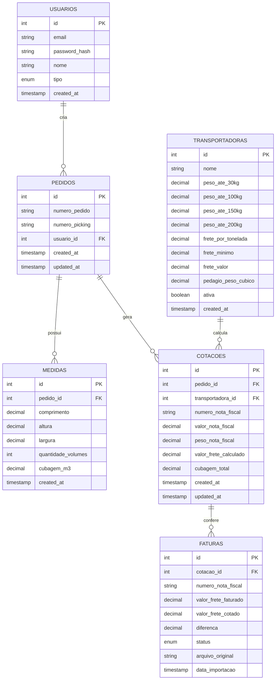

# Arquitetura Técnica - Sistema de Controle de Fretes

## 1. Design da Arquitetura



## 2. Descrição das Tecnologias

* Frontend: PHP\@8.2 + Bootstrap\@5 + JavaScript (ES6+)

* Backend: Apache\@2.4 + PHP\@8.2 + PDO MySQL

* Banco de Dados: MySQL\@8.0

* Containerização: Docker + Docker Compose

## 3. Definições de Rotas

| Rota             | Propósito                                |
| ---------------- | ---------------------------------------- |
| /                | Página inicial com dashboard de métricas |
| /login           | Página de autenticação do usuário        |
| /pedidos         | Cadastro e listagem de pedidos           |
| /pedidos/:id     | Edição de pedido específico              |
| /cotacoes        | Cotação de fretes                        |
| /relatorios      | Geração e visualização de relatórios     |
| /transportadoras | Cadastro e gestão de transportadoras     |
| /conferencia     | Conferência de faturas importadas        |

## 4. Definições de API

### 4.1 APIs Principais

**Autenticação de usuários**

```
POST /auth/login.php
```

Request:

| Nome do Parâmetro | Tipo   | Obrigatório | Descrição        |
| ----------------- | ------ | ----------- | ---------------- |
| email             | string | true        | Email do usuário |
| password          | string | true        | Senha do usuário |

Response:

| Nome do Parâmetro | Tipo    | Descrição                   |
| ----------------- | ------- | --------------------------- |
| success           | boolean | Status da autenticação      |
| token             | string  | Token JWT para autenticação |
| user              | object  | Dados do usuário            |

**Gestão de Pedidos**

```
POST /pedidos/criar.php
GET /pedidos/listar.php
POST /pedidos/editar.php
POST /pedidos/excluir.php
```

**Gestão de Medidas**

```
POST /medidas/criar.php
POST /medidas/excluir.php
```

**Cotações de Frete**

```
POST /cotacoes/criar.php
GET /cotacoes/listar.php
POST /cotacoes/editar.php
```

**Transportadoras**

```
POST /transportadoras/criar.php
GET /transportadoras/listar.php
POST /transportadoras/editar.php
POST /transportadoras/excluir.php
```

**Relatórios**

```
GET /relatorios/listar.php
POST /relatorios/exportar.php
```

**Conferência de Faturas**

```
POST /faturas/upload.php
GET /faturas/comparacao.php
```

Exemplo de Request (Cadastro de Pedido):

```json
{
  "numero_pedido": "PED-2024-001",
  "numero_picking": "PICK-001",
  "medidas": [
    {
      "comprimento": 50,
      "altura": 30,
      "largura": 40,
      "quantidade_volumes": 2
    }
  ]
}
```

## 5. Diagrama da Arquitetura do Servidor



## 6. Modelo de Dados

### 6.1 Definição do Modelo de Dados



### 6.2 Linguagem de Definição de Dados

**Tabela de Usuários (usuarios)**

```sql
-- Criar tabela
CREATE TABLE usuarios (
    id INT AUTO_INCREMENT PRIMARY KEY,
    email VARCHAR(255) UNIQUE NOT NULL,
    password_hash VARCHAR(255) NOT NULL,
    nome VARCHAR(100) NOT NULL,
    tipo ENUM('operacional', 'administrador') DEFAULT 'operacional',
    created_at TIMESTAMP DEFAULT CURRENT_TIMESTAMP
);

-- Criar índices
CREATE INDEX idx_usuarios_email ON usuarios(email);
```

**Tabela de Pedidos (pedidos)**

```sql
-- Criar tabela
CREATE TABLE pedidos (
    id INT AUTO_INCREMENT PRIMARY KEY,
    numero_pedido VARCHAR(50) UNIQUE NOT NULL,
    numero_picking VARCHAR(50) NOT NULL,
    usuario_id INT,
    created_at TIMESTAMP DEFAULT CURRENT_TIMESTAMP,
    updated_at TIMESTAMP DEFAULT CURRENT_TIMESTAMP ON UPDATE CURRENT_TIMESTAMP,
    FOREIGN KEY (usuario_id) REFERENCES usuarios(id)
);

-- Criar índices
CREATE INDEX idx_pedidos_numero_pedido ON pedidos(numero_pedido);
CREATE INDEX idx_pedidos_numero_picking ON pedidos(numero_picking);
CREATE INDEX idx_pedidos_usuario_id ON pedidos(usuario_id);
```

**Tabela de Medidas (medidas)**

```sql
-- Criar tabela
CREATE TABLE medidas (
    id INT AUTO_INCREMENT PRIMARY KEY,
    pedido_id INT,
    comprimento DECIMAL(10,2) NOT NULL,
    altura DECIMAL(10,2) NOT NULL,
    largura DECIMAL(10,2) NOT NULL,
    quantidade_volumes INT NOT NULL DEFAULT 1,
    cubagem_m3 DECIMAL(10,4) GENERATED ALWAYS AS ((comprimento * altura * largura * quantidade_volumes) / 1000000) STORED,
    created_at TIMESTAMP DEFAULT CURRENT_TIMESTAMP,
    FOREIGN KEY (pedido_id) REFERENCES pedidos(id) ON DELETE CASCADE
);

-- Criar índices
CREATE INDEX idx_medidas_pedido_id ON medidas(pedido_id);
```

**Tabela de Transportadoras (transportadoras)**

```sql
-- Criar tabela
CREATE TABLE transportadoras (
    id INT AUTO_INCREMENT PRIMARY KEY,
    nome VARCHAR(100) NOT NULL,
    peso_ate_30kg DECIMAL(10,2),
    peso_ate_100kg DECIMAL(10,2),
    peso_ate_150kg DECIMAL(10,2),
    peso_ate_200kg DECIMAL(10,2),
    frete_por_tonelada DECIMAL(10,2),
    frete_minimo DECIMAL(10,2),
    frete_valor DECIMAL(5,2),
    pedagio_peso_cubico DECIMAL(10,2),
    ativa BOOLEAN DEFAULT TRUE,
    created_at TIMESTAMP DEFAULT CURRENT_TIMESTAMP
);
```

**Tabela de Cotações (cotacoes)**

```sql
-- Criar tabela
CREATE TABLE cotacoes (
    id INT AUTO_INCREMENT PRIMARY KEY,
    pedido_id INT,
    transportadora_id INT,
    numero_nota_fiscal VARCHAR(50) NOT NULL,
    valor_nota_fiscal DECIMAL(12,2) NOT NULL,
    peso_nota_fiscal DECIMAL(10,2) NOT NULL,
    valor_frete_calculado DECIMAL(12,2) NOT NULL,
    cubagem_total DECIMAL(10,4),
    created_at TIMESTAMP DEFAULT CURRENT_TIMESTAMP,
    updated_at TIMESTAMP DEFAULT CURRENT_TIMESTAMP ON UPDATE CURRENT_TIMESTAMP,
    UNIQUE(numero_nota_fiscal),
    FOREIGN KEY (pedido_id) REFERENCES pedidos(id),
    FOREIGN KEY (transportadora_id) REFERENCES transportadoras(id)
);

-- Criar índices
CREATE INDEX idx_cotacoes_pedido_id ON cotacoes(pedido_id);
CREATE INDEX idx_cotacoes_numero_nota ON cotacoes(numero_nota_fiscal);
CREATE INDEX idx_cotacoes_transportadora_id ON cotacoes(transportadora_id);
```

**Tabela de Faturas (faturas)**

```sql
-- Criar tabela
CREATE TABLE faturas (
    id INT AUTO_INCREMENT PRIMARY KEY,
    cotacao_id INT,
    numero_nota_fiscal VARCHAR(50) NOT NULL,
    valor_frete_faturado DECIMAL(12,2) NOT NULL,
    valor_frete_cotado DECIMAL(12,2),
    diferenca DECIMAL(12,2) GENERATED ALWAYS AS (valor_frete_faturado - valor_frete_cotado) STORED,
    status ENUM('pendente', 'conferido', 'divergente') DEFAULT 'pendente',
    arquivo_original VARCHAR(255),
    data_importacao TIMESTAMP DEFAULT CURRENT_TIMESTAMP,
    FOREIGN KEY (cotacao_id) REFERENCES cotacoes(id)
);

-- Criar índices
CREATE INDEX idx_faturas_numero_nota ON faturas(numero_nota_fiscal);
CREATE INDEX idx_faturas_status ON faturas(status);
```

**Dados Iniciais**

```sql
-- Criar banco de dados
CREATE DATABASE sistema_fretes CHARACTER SET utf8mb4 COLLATE utf8mb4_unicode_ci;
USE sistema_fretes;

-- Inserir usuário administrador padrão
INSERT INTO usuarios (email, password_hash, nome, tipo) VALUES 
('admin@sistema.com', '$2y$10$exemplo_hash_senha_php', 'Administrador', 'administrador');

-- Inserir transportadora exemplo
INSERT INTO transportadoras (nome, peso_ate_30kg, peso_ate_100kg, peso_ate_150kg, peso_ate_200kg, frete_por_tonelada, frete_minimo, frete_valor, pedagio_peso_cubico) VALUES 
('Transportadora Exemplo', 15.00, 25.00, 35.00, 45.00, 120.00, 50.00, 2.5, 8.00);

-- Inserir pedido exemplo
INSERT INTO pedidos (numero_pedido, numero_picking, usuario_id) VALUES 
('PED-2024-001', 'PICK-001', 1);

-- Inserir medida exemplo
INSERT INTO medidas (pedido_id, comprimento, altura, largura, quantidade_volumes) VALUES 
(1, 50.00, 30.00, 40.00, 2);
```

