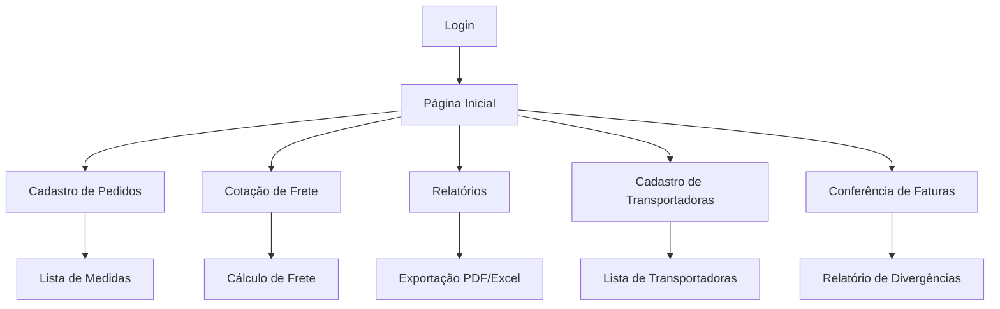

# Sistema de Controle Interno de Fretes

## 1. Visão Geral do Produto

Sistema web para controle interno de fretes que permite gerenciar pedidos, calcular cotações de frete, gerar relatórios e conferir faturas de transportadoras.

O sistema resolve a necessidade de centralizar e automatizar o processo de gestão de fretes, desde o cadastro de pedidos até a conferência de faturas, proporcionando maior controle e eficiência operacional.

## 2. Funcionalidades Principais

### 2.1 Papéis de Usuário

| Papel | Método de Registro | Permissões Principais |
|-------|-------------------|----------------------|
| Usuário Operacional | Login com credenciais | Pode cadastrar pedidos, fazer cotações e gerar relatórios |
| Administrador | Acesso administrativo | Pode gerenciar transportadoras, configurar sistema e acessar todas as funcionalidades |

### 2.2 Módulos de Funcionalidades

Nosso sistema de controle de fretes consiste nas seguintes páginas principais:

1. **Página Inicial**: dashboard com resumo de atividades, navegação principal, indicadores de performance.
2. **Cadastro de Pedidos**: formulário de entrada de dados, lista de medidas por pedido, edição de pedidos existentes.
3. **Cotação de Frete**: filtros de busca, formulário de cotação, cálculo automático de frete, seleção de transportadora.
4. **Relatórios**: filtros avançados, visualização de dados, exportação para PDF/Excel.
5. **Cadastro de Transportadoras**: formulário de cadastro, lista de transportadoras, edição de dados.
6. **Conferência de Faturas**: importação de arquivos, comparação automática, relatório de divergências.
7. **Login**: autenticação de usuários, recuperação de senha.

### 2.3 Detalhes das Páginas

| Nome da Página | Nome do Módulo | Descrição da Funcionalidade |
|----------------|----------------|-----------------------------|
| Página Inicial | Dashboard | Exibir resumo de pedidos, cotações pendentes, indicadores de performance e navegação rápida |
| Cadastro de Pedidos | Formulário de Pedido | Cadastrar número do pedido, número do picking, múltiplas medidas (comprimento, altura, largura, quantidade) |
| Cadastro de Pedidos | Lista de Medidas | Visualizar, editar e excluir medidas cadastradas por pedido |
| Cadastro de Pedidos | Edição de Pedidos | Modificar dados de pedidos já salvos no banco de dados |
| Cotação de Frete | Filtros de Busca | Filtrar pedidos por número do pedido ou picking para cotação |
| Cotação de Frete | Dados da Nota Fiscal | Inserir número, valor e peso da nota fiscal |
| Cotação de Frete | Seleção de Transportadora | Escolher transportadora e calcular frete baseado na tabela cadastrada |
| Cotação de Frete | Cálculo de Frete | Calcular automaticamente o valor do frete usando percentual da transportadora sobre valor da nota |
| Relatórios | Filtros Avançados | Filtrar por datas, número de pedido, picking, nota fiscal e transportadora |
| Relatórios | Exportação | Gerar relatórios em formato PDF ou Excel |
| Cadastro de Transportadoras | Formulário de Transportadora | Cadastrar dados das transportadoras conforme tabela de fretes |
| Cadastro de Transportadoras | Lista de Transportadoras | Visualizar, editar e gerenciar transportadoras cadastradas |
| Conferência de Faturas | Importação de Arquivos | Importar faturas emitidas pelas transportadoras |
| Conferência de Faturas | Comparação Automática | Comparar dados importados com cotações salvas (número da nota e valor do frete) |
| Conferência de Faturas | Relatório de Divergências | Exibir diferenças encontradas entre faturas e cotações |
| Login | Autenticação | Realizar login no sistema e recuperação de senha |

## 3. Processo Principal

**Fluxo Operacional Principal:**

1. Usuário faz login no sistema
2. Cadastra pedidos com suas respectivas medidas para cálculo de cubagem
3. Realiza cotação de frete selecionando pedidos e informando dados da nota fiscal
4. Sistema calcula automaticamente o valor do frete baseado na transportadora escolhida
5. Gera relatórios para acompanhamento e controle
6. Importa faturas das transportadoras para conferência
7. Compara valores faturados com cotações realizadas

## 4. Design da Interface do Usuário

### 4.1 Estilo de Design

- **Cores primárias**: Azul (#2563eb) e branco (#ffffff)
- **Cores secundárias**: Cinza (#6b7280) e verde (#10b981) para status
- **Estilo de botões**: Arredondados com sombra sutil
- **Fonte**: Inter, tamanhos 14px (corpo), 16px (títulos), 24px (cabeçalhos)
- **Layout**: Baseado em cards com navegação lateral fixa
- **Ícones**: Lucide React para consistência visual

### 4.2 Visão Geral do Design das Páginas

| Nome da Página | Nome do Módulo | Elementos da UI |
|----------------|----------------|----------------|
| Página Inicial | Dashboard | Cards com métricas, gráficos simples, menu lateral azul, botões de ação rápida |
| Cadastro de Pedidos | Formulário | Campos de entrada organizados em grid, botão "Adicionar Medida", tabela responsiva para medidas |
| Cotação de Frete | Filtros e Cálculo | Campos de busca no topo, formulário em duas colunas, dropdown para transportadoras, resultado destacado |
| Relatórios | Filtros e Exportação | Filtros em sidebar, tabela de resultados, botões de exportação com ícones |
| Cadastro de Transportadoras | CRUD Transportadoras | Formulário modal, tabela com ações inline, campos para dados de frete |
| Conferência de Faturas | Upload e Comparação | Área de drag-and-drop, tabela de comparação com status colorido, alertas para divergências |

### 4.3 Responsividade

O sistema é desktop-first com adaptação para tablets. Layout responsivo com breakpoints em 768px e 1024px, mantendo funcionalidade completa em dispositivos móveis com navegação colapsável.